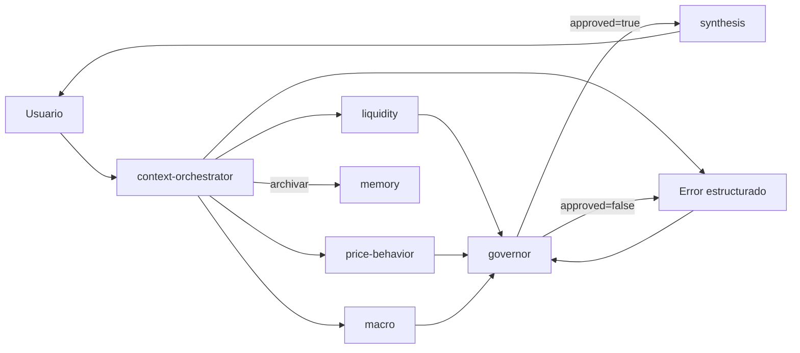
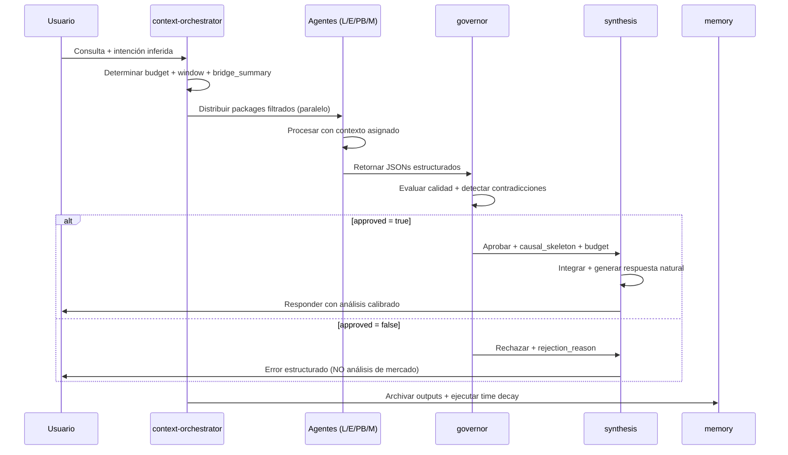

# AETHEER — Sistema de Inteligencia de Mercado para Forex
> Versión: 2.0 | Última actualización: 2026-04-19 | Schema: D001-D017

---

## Propósito del Proyecto

Aetheer es un **copiloto cognitivo para trading de Forex** que proporciona contexto estructurado — no señales de ejecución.

### Lo que Aetheer SÍ hace:
- Analiza estructura de precio, liquidez, eventos macro y correlaciones
- Integra datos multi-fuente con trazabilidad completa
- Genera análisis en lenguaje natural con cadenas causales
- Adapta profundidad según disponibilidad de datos (Operating Modes)

### Lo que Aetheer NO hace:
- Ejecutar trades o gestionar posiciones
- Emitir señales de compra/venta ("entry en X", "take profit")
- Predecir resultados de eventos no publicados
- Presentar datos históricos como actuales

---

## Stack Técnico

| Componente | Tecnología | Propósito |
|------------|-----------|-----------|
| Runtime | Python 3.12+ | MCP servers, scripts, validación |
| Memoria | SQLite (`db/aetheer.db`) | Persistencia con compresión y decay |
| Orquestación | Subagentes Claude Code | Procesamiento paralelo especializado |
| Datos | MCP servers custom | Abstracción de fuentes de mercado |
| Validación | JSON Schema + Pydantic | Garantizar integridad inter-agente |

---

## Cobertura de Mercado

```yaml
instrumentos:
  primario: "US Dollar Index (DXY)"
  operativos: ["EURUSD", "GBPUSD"]
  correlaciones: ["XAUUSD", "VIX", "SPX", "US10Y", "US02Y", "USOIL", "DE10Y", "GB10Y"]

horizontes:
  intradía: "M15, H1, H4"
  swing: "D1, W1 (máx 1 mes)"

sesiones_utc:
  Asian: "00:00-08:00"
  London: "08:00-16:00"
  NewYork: "13:00-21:00"
  Overlap: "13:00-16:00"  # London-NY
```

---

## Arquitectura de Agentes (6 especialidades)



| Agente | Responsabilidad | Output Clave | D-Ref |
|--------|----------------|--------------|-------|
| `liquidity` | Volatilidad intradía, ventanas óptimas | `liquidity_level`, `optimal_windows_utc` | D009 |
| `events` | Calendario económico, reacción post-dato | `event_risk_next_24h`, `priced_in` | D007 |
| `price-behavior` | Estructura de precio, patrones, rupturas | `causal_chains`, `breakout_probability` | D009 |
| `macro` | Política monetaria, yields, geopolítica | `macro_bias`, `rate_differentials` | D007 |
| `context-orchestrator` | Gestión de contexto, pruning, routing | `packages`, `operating_mode`, `budget_tokens` | D006 |
| `synthesis` | Integración final, respuesta al usuario | Texto en lenguaje natural, 1000-1400 palabras | D003 |
| `governor` | Validación de calidad, aprobación final | `approved`, `quality_score_global`, `causal_skeleton` | D007 |

---

## Reglas Absolutas (No negociables)

### KILL SWITCH — DXY Data Integrity
```python
# Antes de CUALQUIER análisis:
if dxy_price_unavailable OR dxy_age_hours > 4:
    return "Error de conexión en vivo. Ingresa el precio actual del DXY para continuar."
    # NO invocar otros agentes
    # NO generar análisis parcial
    # Loguear incidente en memory
```

### Anti-Alucinación Temporal (D001)
```yaml
PROHIBIDO calcular mentalmente:
  - Día de la semana actual
  - Si hoy es feriado
  - Qué sesión está activa
  - "Mañana", "ayer", "próxima semana"

OBLIGATORIO usar:
  - tool: get_current_time
  - script: scripts/now.py
  - MCP: time-service (si disponible)

Fallback si no hay tiempo disponible:
  → Usar "al momento de este análisis"
  → NO inventar fechas ni horas
```

### Prohibiciones de Output
```yaml
NUNCA emitir:
  - "compra", "vende", "entry en", "take profit", "stop loss"
  - Frases motivacionales o de timing emocional
  - Predicciones categóricas sin confidence score
  - Datos históricos presentados como actuales

SIEMPRE incluir:
  - Fuente + timestamp para cada precio: "DXY: 104.82 (TradingView, 14:30 UTC)"
  - Banner de Operating Mode si != FULL
  - quality_score_global en footer del análisis
  - Nota explícita si dato es fallback: "(Alpha Vantage, hace 2h)"
```

### Comunicación Inter-Agente
```yaml
Formato: JSON estricto validado contra schema
Ejemplo mínimo:
{
  "agent": "price_behavior",
  "agent_version": "1.1.0",
  "execution_meta": {"operating_mode": "FULL", "data_quality": "high"},
  "timestamp": "ISO8601"
}

Validación:
  - Pre-retorno: validar contra schema correspondiente
  - Post-recepción: rechazar JSON inválido con error estructurado
  - Fallback: si validación falla 2 veces, retornar error minimal
```

---

## Operating Modes (D006)

| Modo | Condiciones | Implicaciones | Budget Máx |
|------|------------|---------------|------------|
| **FULL** | quality_score >= 0.90, todos los datos <2h, sin contradicciones críticas | Análisis completo, causal_chains habilitados | 6144 tokens |
| **DEGRADED_TRANSIENT** | quality_score [0.75-0.90) o algún dato 2-4h | Análisis con advertencias, fallbacks marcados | 4096 tokens |
| **DEGRADED_PERSISTENT** | quality_score [0.60-0.75) o múltiples fuentes degradadas | Solo análisis estructural básico, sin macro profundo | 2048 tokens |
| **MINIMAL** | quality_score [0.60-0.75) con datos limitados | Solo precio + liquidez, sin cadenas causales | 2048 tokens |
| **OFFLINE** | quality_score < 0.60 OR DXY >4h OR price-feed down | Kill Switch activado, solo error estructurado | 0 tokens |

### Transiciones Automáticas
```python
# Ejemplo: FULL → DEGRADED_TRANSIENT
if any(data_source.age_hours > 2 for data_source in critical_sources):
    operating_mode = "DEGRADED_TRANSIENT"
    # synthesis debe marcar datos con fallback explícitamente

# Ejemplo: cualquier modo → OFFLINE
if dxy_age_hours > 4 or quality_score_global < 0.60:
    operating_mode = "OFFLINE"
    approved = false  # governor bloquea análisis
```

---

## Flujo de Consulta (End-to-End)



---

## Tipos de Consulta y Respuesta

| Intención | Trigger Examples | Agentes Invocados | Longitud | Tiempo Est. |
|-----------|-----------------|-------------------|----------|-------------|
| `full_analysis` | "análisis completo", "visión macro", "¿qué esperas hoy?" | Todos + governor | 1000-1400 palabras | 30-45s |
| `punctual` | "¿qué hará EURUSD?", "sesgo DXY", "liquidez Londres" | Relevantes por tema | 50-200 palabras | 10-20s |
| `data_point` | "precio DXY", "¿qué dijo la Fed?", "CPI real vs esperado" | Directo a fuente | 1-3 oraciones | 2-5s |
| `validate_setup` | "¿confirma mi setup en EURUSD?", "ruptura en H4" | price-behavior + liquidity | 200-400 palabras | 15-25s |
| `system_health` | "status", "¿funciona?", "health check" | heartbeat de todos | Tabla + badges | 5-10s |

---

## Estilo de Respuesta (synthesis)

### Tono y Formato
```yaml
tono:
  - Analista institucional senior: directo, preciso, sin relleno
  - Jerga de mercado cuando es precisa: hawkish, dovish, risk-off, carry trade
  - Español claro: oraciones cortas, cero palabrería

estructura:
  - Cadenas causales con flechas: "CPI > esperado → USD strength → EURUSD -0.3%"
  - Secciones con emojis para escaneo visual: 📈 🔍 📉 🌍 🛢️ 📊 🧠 💱 📅 🗺️
  - Footer con metadata: fuentes, calidad, timestamp, operating_mode

contradicciones:
  - SIEMPRE exponer, nunca ocultar: "⚠️ Los agentes reportan señales mixtas:"
  - Listar: {{agente_a}} dice X | {{agente_b}} dice Y
  - Concluir: "Recomendación: esperar confirmación en {{key_level}}"
```

### Ejemplo de Fragmento Válido
```markdown
### Sesgo del dólar
**[Alcista]** (confianza: 74%)
Cadena causal: NFP +36K vs consenso → yields US10Y +7bps → DXY +0.42% en 15min → estructura H4 alcista se mantiene

⚠️ Contradicción detectada: macro bias neutral por expectativas mixtas de CPI próximo
→ Recomendación: priorizar estructura H4 para timing, esperar dato CPI para confirmación D1
```

---

## MCP Servers — Integración y Fallbacks

### price-feed (Prioridad 0: TradingView)
```yaml
disponibilidad:
  - Detectar automáticamente: TradingView Desktop con --remote-debugging-port=9222
  - Cache de estado: 30 segundos (evitar polling excesivo)
  - Fallback transparente: si TV se desconecta → cascada sin mencionar al usuario

símbolos_tv:
  DXY: "TVC:DXY"
  EURUSD: "OANDA:EURUSD"  # OANDA: es exchange dentro de TV, NO API externa
  GBPUSD: "OANDA:GBPUSD"
  XAUUSD: "OANDA:XAUUSD"
  VIX: "TVC:VIX"
  SPX: "SP:SPX"
  US10Y: "TVC:US10Y"
  US02Y: "TVC:US02Y"
  USOIL: "TVC:USOIL"
  DE10Y: "TVC:DE10Y"  # "last known" en feriados europeos
  GB10Y: "TVC:GB10Y"

calidad:
  quality_score: 0.98
  divergence_threshold_pct: 0.15  # ±1-3 pips entre fuentes es normal
```

### Cascada de Fuentes (automática, sin acción del usuario)
```python
def get_price(symbol: str) -> PriceData:
    sources = [
        ("tradingview", 0.98, check_tv_available),
        ("alpha_vantage", 0.85, check_api_key),  # Solo EURUSD/GBPUSD
        ("tradingeconomics", 0.70, scrape_with_timeout),
        ("investing", 0.65, scrape_with_timeout),
        ("yahoo_finance", 0.60, scrape_with_timeout),  # DXY: "DX-Y.NYB"
    ]
    
    for source_name, quality, availability_check in sources:
        if availability_check() and data := fetch_from_source(source_name, symbol):
            return enrich_with_metadata(data, source_name, quality)
    
    return None  # Kill Switch se activará aguas arriba
```

### Lectura Multi-Timeframe (D008)
```yaml
modos:
  lectura_rapida:
    duración: "~2-3s"
    interferencia: "ninguna"
    método: quote_get de 8 símbolos
    uso: heartbeat, data_point, system_health
  
  lectura_profunda:
    duración: "~24-30s"
    interferencia: "temporal_chart_lock"  # Bloquea chart del trader
    método: Cambiar tabs + timeframes + leer OHLCV + Aetheer indicator
    setup_requerido:
      - Tab 0: TVC:DXY + Aetheer Indicator
      - Tab 1: OANDA:EURUSD + Aetheer Indicator
      - Tab 2: OANDA:GBPUSD + Aetheer Indicator
    uso: full_analysis, validate_setup

profundidad_por_intención:
  full_analysis: {tabs: [DXY, EURUSD, GBPUSD], timeframes: [D1,H4,H1,M15], tiempo: "24-30s"}
  validate_setup: {tabs: [DXY, par], timeframes: [H1,M15], tiempo: "8-10s"}
  macro_question: {tabs: [DXY], timeframes: [D1,H4], tiempo: "4-6s"}
  sudden_move: {tabs: [par_afectado], timeframes: [M15,H1], tiempo: "4-6s"}
  data_point: {tabs: [], timeframes: [], tiempo: "2s"}  # Solo quote
```

---

## Indicador Aetheer (D009)

### Especificación Técnica
```pine
// Ubicación: indicators/aetheer_indicator.pine
// Propósito: Exportar datos estructurados vía JSON para consumo MCP
// NO usar como indicador visual de trading — la tabla es solo debug

datos_exportados:
  volatilidad:
    - atr14, atr14_sma, atr_expanding (boolean)
    - vol_rel, session_range
  
  estructura:
    - ema20/50/200 + price_vs_emaXX (above/below/at)
    - ema_align (bullish/bearish/mixed)
    - rsi14 + rsi_div (bull_div/bear_div/none)
    - price_phase (compression/expansion/transition) via Bollinger Width
  
  sesiones:
    - session (Asian|London|NewYork|London-NY-Overlap|OffHours)  # Naming EXACTO
    - sess_high/low, prev_sess_high/low
    - sess_break (broke_high/broke_low/inside)
  
  niveles_clave:
    - prev_day_high/low, day_open
    - prev_week_high/low
  
  multi_tf:
    - htf_d1_ema_align, htf_h4_ema_align
    - h1_phase, m15_atr14
  
  metadata:
    - aetheer_version: "1.2.0"
    - timestamp_utc: epoch_ms  # Para cálculo de age_hours
    - symbol, timeframe
    - data_quality: "high"  # Placeholder, MCP enriquece
    - source: "tradingview"  # Confirmado por MCP
```

### Consumo por Agentes
```python
# Ejemplo: price-behavior lee indicador Aetheer
def read_aetheer_data(symbol: str, timeframe: str) -> dict:
    # 1. Obtener JSON del label en TradingView vía MCP
    json_text = tv_mcp.get_label_text(symbol, timeframe, "Aetheer")
    
    # 2. Parsear y enriquecer
    data = json.loads(json_text)
    data["age_hours"] = (time.time()*1000 - data["timestamp_utc"]) / 3600000
    data["source"] = "tradingview"  # Confirmado
    
    # 3. Calcular campos derivados si hay histórico
    if has_historical_bb_width(symbol):
        data["bb_width_percentile"] = calculate_percentile(
            data["bb_width"], get_historical_bb_width(symbol, days=30)
        )
    
    return data
```

---

## Memoria Persistente (SQLite + Time Decay)

### Esquema de Base de Datos (`db/aetheer.db`)
```sql
-- FUENTE DE VERDAD: schema real en DB. Migraciones en db/migrations/
CREATE TABLE price_snapshots (
    id INTEGER PRIMARY KEY AUTOINCREMENT,
    instrument TEXT NOT NULL,       -- 'DXY', 'EURUSD', 'GBPUSD'
    price REAL NOT NULL,
    source TEXT NOT NULL,
    timestamp_utc TEXT NOT NULL,
    created_at TEXT DEFAULT (datetime('now'))
);

CREATE TABLE events (
    id INTEGER PRIMARY KEY AUTOINCREMENT,
    event_name TEXT NOT NULL,
    currency TEXT NOT NULL,
    importance TEXT NOT NULL,       -- 'high'|'medium'|'low'
    expected REAL,
    actual REAL,
    previous REAL,
    previous_revision REAL,
    surprise_direction TEXT,
    price_reaction_dxy_pct REAL,
    reaction_duration_min INTEGER,
    priced_in INTEGER DEFAULT 0,    -- 0|1 (boolean)
    event_datetime_utc TEXT NOT NULL,
    source TEXT DEFAULT 'live',
    result_status TEXT DEFAULT 'pending',
    preloaded_at TEXT,
    created_at TEXT DEFAULT (datetime('now'))
);

CREATE TABLE context_memory (
    id INTEGER PRIMARY KEY AUTOINCREMENT,
    layer TEXT NOT NULL CHECK(layer IN ('short', 'medium', 'long')),
    category TEXT NOT NULL,         -- 'analysis_summary'|'causal_chain'|'user_pref'|etc.
    content TEXT NOT NULL,          -- JSON (comprimido si compressed=1)
    relevance_base REAL DEFAULT 1.0,
    relevance_current REAL DEFAULT 1.0,
    decay_factor REAL DEFAULT 0.95,
    access_count INTEGER DEFAULT 0,
    compressed INTEGER DEFAULT 0,
    created_at TEXT DEFAULT (datetime('now')),
    last_accessed TEXT DEFAULT (datetime('now'))
);

CREATE TABLE agent_outputs (
    id INTEGER PRIMARY KEY AUTOINCREMENT,
    agent_name TEXT NOT NULL,
    output_json TEXT NOT NULL,
    query_intent TEXT,
    output_hash TEXT,               -- sha256 del JSON (migration 003)
    operating_mode TEXT DEFAULT 'UNKNOWN',  -- 'FULL'|'DEGRADED_TRANSIENT'|etc. (migration 003)
    quality_score REAL,             -- (migration 003)
    created_at TEXT DEFAULT (datetime('now'))
);

CREATE TABLE heartbeat_log (
    id INTEGER PRIMARY KEY AUTOINCREMENT,
    status TEXT NOT NULL,           -- 'ok'|'degraded'|'down'
    agents_status TEXT NOT NULL,    -- JSON con estado por agente
    sources_status TEXT NOT NULL,   -- JSON con estado por fuente
    context_health TEXT NOT NULL,   -- JSON con métricas de contexto
    kill_switch_active INTEGER DEFAULT 0,
    created_at TEXT DEFAULT (datetime('now'))
);

-- Tablas adicionales: session_stats, yields_history, feed_status,
-- fedwatch_history, deep_snapshots — ver db/migrations/ para detalle
```

### Time Decay Factors (decay.yaml)
```yaml
time_decay:
  price_current:
    factor: 0.01/min    # Se reemplaza constantemente
  event_reaction:
    factor: 0.85/day    # Vida útil: ~10 días
  macro_bias:
    factor: 0.95/day    # Vida útil: ~60 días
  seasonal_pattern:
    factor: 0.99/day    # Vida útil: ~180 días
  user_preference:
    factor: 0.995/day   # Vida útil: ~365 días
  causal_chain_validated:
    factor: 0.92/day    # Vida útil: ~14 días (D007)

ejecución:
  frecuencia: "hourly"
  on_boot: true
  on_high_buffer: true  # Si buffer >80%, ejecutar decay inmediato

eliminación:
  threshold: 0.05  # relevance_score < 0.05 → eliminar
  criterio_retención:
    - guardar_si: approved == false  # Para diagnóstico de rechazos
    - guardar_si: quality_score_global < 0.80  # Monitoreo de degradación
    - guardar_si: len(contradictions) > 0  # Análisis de consistencia
```

---

## Validación y Calidad (D005, D007)

### Schema Validation (Pydantic + JSON Schema)
```python
# Ejemplo: validar output de price-behavior
from pydantic import BaseModel, Field, validator

class PriceBehaviorOutput(BaseModel):
    agent: Literal["price_behavior"]
    agent_version: str = Field(pattern=r"^\d+\.\d+\.\d+$")
    execution_meta: ExecutionMeta
    instruments: Dict[str, InstrumentData]
    causal_chains: List[CausalChain] = Field(max_items=5)
    # ... más campos
    
    @validator("causal_chains")
    def validate_confidence(cls, v):
        for chain in v:
            assert 0.0 <= chain.confidence <= 1.0, "confidence out of range"
            assert chain.invalid_condition, "invalid_condition required"
        return v

# Uso en agente:
try:
    validated = PriceBehaviorOutput.parse_raw(raw_json)
except ValidationError as e:
    # Reintentar una vez
    if retry_count < 1:
        return regenerate_output()
    else:
        return {"error": "VALIDATION_FAILED", "details": str(e)}
```

### Quality Score Calculation (governor - D007)
```python
def calculate_quality_score(agent_responses: dict, dxy_data: dict) -> float:
    """
    Calcula quality_score_global [0.0, 1.0] con factores ponderados:
    - Freshness (30%): antigüedad de datos clave
    - Completeness (25%): % de campos requeridos presentes
    - Consistency (20%): alineación entre agentes
    - Source reliability (15%): tradingview > cache > fallback
    - Aetheer validity (10%): indicador Pine disponible y válido
    """
    # Implementación detallada en governor.md
    # Retorna score redondeado a 2 decimales
```

### Contradiction Detection (D007)
```python
def detect_contradictions(agent_responses: dict) -> List[Contradiction]:
    """
    Identifica inconsistencias lógicas entre agentes:
    - price-behavior bullish vs macro neutral → bias_mismatch
    - liquidity low vs events high-risk → liquidity_event_mismatch
    - Aetheer phase conflict entre timeframes → NO es contradicción (es contexto)
    
    Retorna lista con: type, severity (high/medium/low), description, resolution_hint
    """
```

---

## Observabilidad y Métricas

### Métricas Clave a Exportar
```yaml
metrics:
  calidad:
    - governor.quality_score_global (time series)
    - governor.operating_mode (state changes)
    - price-feed.source_fallback_count (por fuente)
  
  rendimiento:
    - context-orchestrator.processing_duration_ms
    - synthesis.response_latency_ms
    - memory.decay_items_removed_per_hour
  
  consistencia:
    - context-orchestrator.fragmentation_score
    - governor.contradictions_detected_count
    - agent_outputs.validation_failure_rate

alertas:
  - quality_score_global < 0.70 por 3 ejecuciones consecutivas → warning
  - operating_mode = OFFLINE → critical
  - memory.write_failures > 5/hour → warning
  - price-feed.fallback_chain_activated > 10/hour → warning
```

### Health Check Endpoint
```python
# GET /health
{
  "status": "ok | degraded | down",
  "components": {
    "price-feed": {"status": "ok", "source": "tradingview", "last_update": "ISO8601"},
    "memory": {"status": "ok", "size_mb": 42.3, "decay_last_run": "ISO8601"},
    "agents": {
      "liquidity": "ok",
      "events": "ok", 
      "price-behavior": "ok",
      "macro": "degraded",  # ej: macro-data timeout
      "governor": "ok",
      "synthesis": "ok"
    }
  },
  "operating_mode": "DEGRADED_TRANSIENT",
  "quality_score_global": 0.82,
  "timestamp": "ISO8601"
}
```

---

## Testing y Validación del Sistema

### Test Cases Críticos
```yaml
test_suite:
  kill_switch:
    - name: "dxy_stale_4h_plus"
      setup: {mock_dxy_age_hours: 4.1}
      expected: {operating_mode: "OFFLINE", response: "Error de conexión..."}
    
    - name: "dxy_unavailable"
      setup: {mock_price_feed_down: true}
      expected: {approved: false, rejection_reason: "KILL_SWITCH..."}
  
  operating_mode_transitions:
    - name: "full_to_degraded_on_data_age"
      setup: {quality_score: 0.85, dxy_age: 2.5}
      expected: {operating_mode: "DEGRADED_TRANSIENT", banner_present: true}
    
    - name: "degraded_to_offline_on_quality_drop"
      setup: {quality_score: 0.58}
      expected: {operating_mode: "OFFLINE", approved: false}
  
  contradiction_handling:
    - name: "bias_mismatch_medium_severity"
      setup: {pb_bias: "bullish", macro_bias: "neutral"}
      expected: {contradictions_detected: 1, synthesis_exposes: true}
    
    - name: "high_severity_multiple"
      setup: {contradictions: [{severity: "high"}, {severity: "high"}]}
      expected: {approved: false, rejection_reason: "Múltiples contradicciones..."}
  
  fallback_transparency:
    - name: "tv_to_alpha_vantage_fallback"
      setup: {mock_tv_down: true, symbol: "EURUSD"}
      expected: {source: "alpha_vantage", marked_as_fallback: true, user_not_notified_of_tv}
    
    - name: "dxy_scraping_fallback"
      setup: {mock_tv_down: true, symbol: "DXY"}
      expected: {source: "yahoo_finance" or "tradingeconomics", age_marked_if_old: true}
```

### Ejecución de Tests
```bash
# Ejecutar suite completa
python -m pytest tests/ -v --cov=agents --cov-report=html

# Ejecutar solo tests de Kill Switch
python -m pytest tests/test_governor.py::test_kill_switch -v

# Ejecutar con mocks de fuentes degradadas
python -m pytest tests/ -v -k "fallback" --mock-sources=degraded
```

---

## Documentación de Decisiones (DXXX)

| ID | Título | Estado | Enlace |
|----|--------|--------|--------|
| D001 | Regla temporal: prohibición de cálculo mental | ✅ Implementado | `docs/decisions/D001-temporal-rule.md` |
| D003 | Experiencia de usuario: estilo de síntesis | ✅ Implementado | `docs/decisions/D003-synthesis-style.md` |
| D005 | Validación de schemas inter-agente | ✅ Implementado | `docs/decisions/D005-schema-validation.md` |
| D006 | Operating Modes y gestión de degradación | ✅ Implementado | `docs/decisions/D006-operating-modes.md` |
| D007 | Cadenas causales y calidad de decisión | ✅ Implementado | `docs/decisions/D007-causal-chains.md` |
| D008 | Lectura multi-timeframe y interferencia | ✅ Implementado | `docs/decisions/D008-multi-tf-reading.md` |
| D009 | Indicador Aetheer: especificación de datos | ✅ Implementado | `docs/decisions/D009-aetheer-indicator.md` |
| D010 | Versionado de agentes y compatibilidad | 🔄 En progreso | `docs/decisions/D010-agent-versioning.md` |
| D011 | Protocolo de handoff Orchestrator ↔ Governor | 📋 Pendiente | `docs/decisions/D011-handoff-protocol.md` |

---

## Protocolos de Error y Recuperación

### Error Estructurado al Usuario
```json
{
  "error": "ANALYSIS_UNAVAILABLE",
  "reason": "KILL_SWITCH: DXY data unavailable or stale (>4h)",
  "suggestion": "Intentar en 5-10 minutos o consultar datos puntuales con: 'precio DXY'",
  "health_endpoint": "/health",
  "timestamp": "ISO8601"
}
```

### Recuperación Automática
```yaml
escenarios:
  price-feed_timeout:
    acción: "reintentar 1 vez con timeout reducido (5s)"
    fallback: "usar cache si age_hours < 15min"
    si_falla: "marcar source_status=down, continuar con otros agentes"
  
  memory_write_failure:
    acción: "loguear error, continuar ejecución"
    razón: "memory es optimización, no crítico para respuesta"
    monitoreo: "alert si >5 fallos/hour"
  
  governor_timeout:
    acción: "fallback a aprobación condicional con quality_score=0.5"
    advertencia: "synthesis debe marcar análisis como 'baja certeza'"
    post_mortem: "registrar incidente para diagnóstico"
```

---

## Consideraciones Legales y de Uso

```yaml
tradingview_mcp:
  disclaimer: |
    Aetheer usa TradingView MCP para leer datos del gráfico local del trader.
    Esto no constituye trading automatizado — el sistema contextualiza, no ejecuta.
    El usuario asume responsabilidad por la compatibilidad con los Términos de Uso de TradingView.
  
  compliance:
    - No modificar el DOM de TradingView más allá de lo necesario para lectura
    - Respetar rate limits implícitos de la aplicación Desktop
    - No redistribuir datos de TradingView fuera del contexto local del usuario

datos_financieros:
  disclaimer: |
    Los datos de mercado son proporcionados "tal cual" sin garantía de precisión o completitud.
    Aetheer no es un asesor financiero registrado. El análisis generado es informativo, no una recomendación de inversión.
  
  atribución:
    - TradingView: datos de precio e indicadores
    - Alpha Vantage: API de Forex (si se usa)
    - FRED: datos macroeconómicos de la Reserva Federal de St. Louis
    - Fuentes de scraping: mencionar explícitamente cuando se usen como fallback
```

---

> **Nota final**: Este documento es vivo. Cualquier cambio en reglas, arquitectura o flujos debe reflejarse aquí y en los documentos DXXX correspondientes.
> 
> Última revisión: 2026-04-19 | Próxima revisión programada: 2026-05-19
